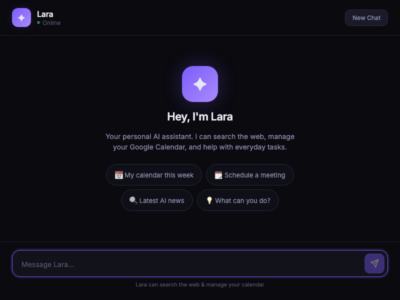

# 🤖 Lara — AI Personal Assistant

An AI-powered personal assistant built with **LangGraph**, **Groq**, and **Google Calendar API**. Lara can search the web, manage your Google Calendar, and hold conversational sessions — all through a simple REST API.

## ✨ Features

- **Conversational AI** — Powered by Groq LLM with tool-calling capabilities
- **Google Calendar Integration** — List, create, update, delete, and view calendar events
- **Web Search** — Search the internet in real-time using Tavily
- **Session Memory** — Maintains conversation context per session via LangGraph checkpointer
- **Auto OAuth Flow** — Automatically opens browser for Google authentication on first run
- **REST API** — Clean Express.js API for easy integration with any frontend
- **Built-in Chat UI** — Dark-themed web interface served at `http://localhost:3000`

## 🖼️ Screenshot



## 🏗️ Architecture

```
┌─────────────┐     ┌──────────────┐     ┌──────────────┐
│  REST API    │────▶│  LangGraph   │────▶│   Groq LLM   │
│  (Express)   │     │   (Graph)    │◀────│  (GPT-OSS)   │
│  server.js   │     │  graph.js    │     │   llm.js     │
└─────────────┘     └──────┬───────┘     └──────────────┘
                           │
                    ┌──────▼───────┐
                    │    Tools     │
                    │  tools.js    │
                    ├──────────────┤
                    │ • Web Search │
                    │ • List Events│
                    │ • Create     │
                    │ • Update     │
                    │ • Delete     │
                    │ • Get Event  │
                    └──────────────┘
```

## 📁 Project Structure

```
PersonalAssistance/
├── public/
│   └── index.html          # Chat UI (dark-themed)
├── assets/
│   └── chat-ui.png         # Screenshot for README
├── server.js               # Express server with REST API & OAuth routes
├── index.js                # Chat function entry point
├── graph.js                # LangGraph state graph (LLM ↔ Tools loop)
├── llm.js                  # Groq LLM configuration with tool binding
├── tools.js                # Tool definitions (web search + calendar CRUD)
├── googleCalendar.js       # Google Calendar API wrapper (OAuth + operations)
├── package.json            # Dependencies and project config
├── .env                    # Environment variables (not committed)
└── .gitignore              # Git ignore rules
```

## 🚀 Getting Started

### Prerequisites

- **Node.js** v18+
- **Google Cloud** project with Calendar API enabled
- **Groq** API key
- **Tavily** API key

### 1. Clone & Install

```bash
git clone <your-repo-url>
cd PersonalAssistance
npm install
```

### 2. Configure Environment Variables

Create a `.env` file in the project root:

```env
GROQ_API_KEY="your-groq-api-key"
TAVILY_API_KEY="your-tavily-api-key"
GOOGLE_CLIENT_ID="your-google-client-id"
GOOGLE_CLIENT_SECRET="your-google-client-secret"
GOOGLE_REFRESH_TOKEN=""  # Auto-populated after first OAuth flow
```

### 3. Run the Server

```bash
node server.js
```

On first run, if no `GOOGLE_REFRESH_TOKEN` is set, the server automatically opens your browser for Google OAuth authentication. The refresh token is saved to `.env` automatically.

## 📡 API Endpoints

### Chat

```http
POST /chat
Content-Type: application/json

{
  "message": "What's on my calendar this week?",
  "sessionId": "user-123"
}
```

**Response:**

```json
{
  "message": "You have 3 events this week: ..."
}
```

### Google OAuth

| Endpoint | Method | Description |
|---|---|---|
| `/auth/google` | GET | Redirects to Google consent screen |
| `/oauth/callback` | GET | Handles OAuth callback and saves refresh token |

## 🛠️ Available Tools

| Tool | Description |
|---|---|
| `webSearch` | Search the internet using Tavily |
| `listCalendarEvents` | List upcoming calendar events |
| `createCalendarEvent` | Create a new calendar event |
| `updateCalendarEvent` | Update an existing event |
| `deleteCalendarEvent` | Delete a calendar event |
| `getCalendarEvent` | Get full details of a specific event |

## 🔧 Tech Stack

- **Runtime:** Node.js (ES Modules)
- **LLM:** Groq (`openai/gpt-oss-120b`)
- **Framework:** [LangChain](https://js.langchain.com/) + [LangGraph](https://langchain-ai.github.io/langgraphjs/)
- **Web Search:** [Tavily](https://tavily.com/)
- **Calendar:** [Google Calendar API v3](https://developers.google.com/calendar)
- **Server:** [Express.js v5](https://expressjs.com/)

## 📄 License

ISC
